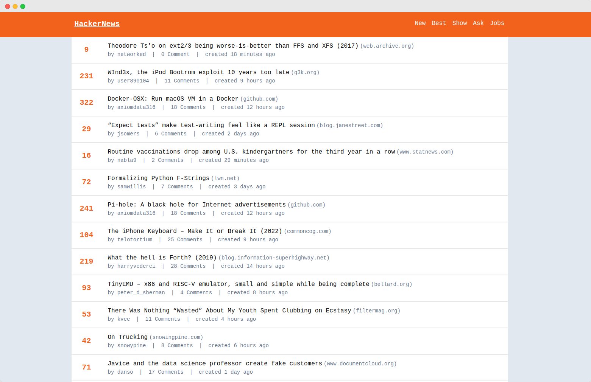
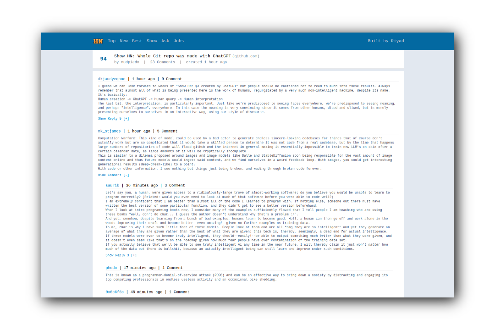

# Hacker News 


### Built with 

<p align="center">
    
</p>

Hacker News clone built with [VUE3](https://vuejs.org), [Pinia](https://pinia.vuejs.org/), [Tailwind](https://tailwindcss.com/) & [VueUse](https://vueuse.org/)

<p align="center">
  <a href="https://hnews-nurriyad.netlify.com" target="_blank">
    
    
    <br>
    Live Demo
  </a>
</p>

## Demo

https://hnews-nurriyad.netlify.app/

> Hosted on [Netlify](https://netlify.com/): `npm run build`


## Features

- Client Side Rendering
- Vite-based hot module replacement (HMR) dev environment
- Deploys anywhere with zero config Netlify
- Content loader 
- Lazy load comment

## Build Setup

**Requires Node.js 16+**

``` bash
# install dependencies
npm install # or yarn

# serve in dev mode, with hot reload at localhost:3000
npm run dev

# build for production (server-side rendering)
npm run build

# serve in production mode (server-side rendering)
npm start

```